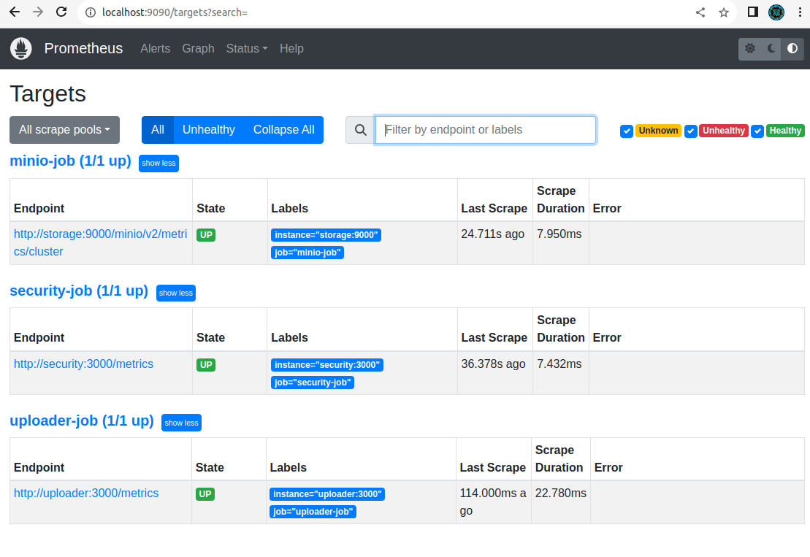

# Ответы к домашнему заданию к занятию «Микросервисы: подходы»

## Задание:
Вы работаете в крупной компании, которая строит систему на основе микросервисной архитектуры.
Вам как DevOps-специалисту необходимо выдвинуть предложение по организации инфраструктуры для разработки и эксплуатации.

### Задача 1: Обеспечить разработку

Предложите решение для обеспечения процесса разработки: хранение исходного кода, непрерывная интеграция и непрерывная поставка. 
Решение может состоять из одного или нескольких программных продуктов и должно описывать способы и принципы их взаимодействия.

Решение должно соответствовать следующим требованиям:
- облачная система;
- система контроля версий Git;
- репозиторий на каждый сервис;
- запуск сборки по событию из системы контроля версий;
- запуск сборки по кнопке с указанием параметров;
- возможность привязать настройки к каждой сборке;
- возможность создания шаблонов для различных конфигураций сборок;
- возможность безопасного хранения секретных данных (пароли, ключи доступа);
- несколько конфигураций для сборки из одного репозитория;
- кастомные шаги при сборке;
- собственные докер-образы для сборки проектов;
- возможность развернуть агентов сборки на собственных серверах;
- возможность параллельного запуска нескольких сборок;
- возможность параллельного запуска тестов.

Обоснуйте свой выбор.

### Решение:

Для вышеуказанных требований подходит GitLab. Обоснование приведено в таблице:

| Требование                                                                |Функционал GitLab                                                          |
|---------------------------------------------------------------------------|---------------------------------------------------------------------------|
| Облачная система                                                          |GitLab возможно развернуть в облаке, например Yandex или Google           |
| Система контроля версий Git                                               |GitLab основан на Git                                                     |
| Репозиторий на каждый сервис                                              |GitLab можно создавать неограниченное количество репозиториев             | 
| Запуск сборки по событию из системы контроля версий                       |Запуск пайплайна возможен по событию в VCS (commit, tag creation, итд.)   | 
| Запуск сборки по кнопке с указанием параметров                            |Возможен ручной запуск пайплайнов                                         |
| Возможность привязать настройки к каждой сборке                           |В GitLab есть возможность привязывать переменные к пайплайну              |
| Возможность создания шаблонов для различных конфигураций сборок           |GitLab поддерживает кастомизированные шаблоны                             |
| Возможность безопасного хранения секретных данных (пароли, ключи доступа) |GitLab поддерживает интеграцию с HashiCorp Vault                          |
| Несколько конфигураций для сборки из одного репозитория                   |GitLab позволяет создавать различные пайплайны для одного репозитория     |
| Кастомные шаги при сборке                                                 |В GitLab пайплайне можно прописывать кастомные stages                     |
| Собственные докер-образы для сборки проектов                              |GitLab позволяет использовать любые образы при конфигурации docker-раннера |
| Возможность развернуть агентов сборки на собственных серверах             |Возможна конфигурация раннера на любом сервере (облачном и физическом)    |
| Возможность параллельного запуска нескольких сборок                       |Количество параллельных запусков пайплайнов не ограничено                 |
| Возможность параллельного запуска тестов                                  |Количество параллельных запусков пайплайнов с тестами не ограничего |                                                                         

## Задача 2: Логи

Предложите решение для обеспечения сбора и анализа логов сервисов в микросервисной архитектуре.
Решение может состоять из одного или нескольких программных продуктов и должно описывать способы и принципы их взаимодействия.

Решение должно соответствовать следующим требованиям:
- сбор логов в центральное хранилище со всех хостов, обслуживающих систему;
- минимальные требования к приложениям, сбор логов из stdout;
- гарантированная доставка логов до центрального хранилища;
- обеспечение поиска и фильтрации по записям логов;
- обеспечение пользовательского интерфейса с возможностью предоставления доступа разработчикам для поиска по записям логов;
- возможность дать ссылку на сохранённый поиск по записям логов.

Обоснуйте свой выбор.

### Решение:

Для вышеуказанных требований подходит ElasticSearch + LogStash + Kibana
(Elastic Stack).
Обоснование приведено в таблице:

| Требование                                                                                                               | Функционал Elastic Stack |
|--------------------------------------------------------------------------------------------------------------------------|--------------------------|
| Сбор логов в центральное хранилище со всех хостов, обслуживающих систему                                                 | Данные хранятся централизованно в одной или нескольких локациях | 
| Минимальные требования к приложениям, сбор логов из stdout                                                               | LogStash имеет плагин для сбора логов из **stdout** |
| Гарантированная доставка логов до центрального хранилища                                                                 | LogStash имеет защиту от потерь данных при ненормальном завершении процесса |
| Обеспечение поиска и фильтрации по записям логов                                                                         | ElasticSearch это поисковая система, основаная на библиотеке Apache Lucene |
| Обеспечение пользовательского интерфейса с возможностью предоставления доступа разработчикам для поиска по записям логов | Kibana обеспечивает пользовательский интерфейс для поиска и поддерживает язык запросов KQL | 
| Возможность дать ссылку на сохранённый поиск по записям логов                                                            | KQL поддерживает ссылки на сохранённые запросы |

## Задача 3: Мониторинг

Предложите решение для обеспечения сбора и анализа состояния хостов и сервисов в микросервисной архитектуре.
Решение может состоять из одного или нескольких программных продуктов и должно описывать способы и принципы их взаимодействия.

Решение должно соответствовать следующим требованиям:
- сбор метрик со всех хостов, обслуживающих систему;
- сбор метрик состояния ресурсов хостов: CPU, RAM, HDD, Network;
- сбор метрик потребляемых ресурсов для каждого сервиса: CPU, RAM, HDD, Network;
- сбор метрик, специфичных для каждого сервиса;
- пользовательский интерфейс с возможностью делать запросы и агрегировать информацию;
- пользовательский интерфейс с возможностью настраивать различные панели для отслеживания состояния системы.

Обоснуйте свой выбор.

### Решение:

Для вышеуказанных требований подходит Prometheus + Grafana.
Prometheus это Time Series Data Base, поддерживает
большое количество источников данных. Сбор осуществляется посредством экспортеров:
node-exporter, cadvisor, blackbox итд.

Обоснование приведено в таблице:

| Требование                                                                                                | Функционал Prometheus + Grafana                                                                                                                                                 |
|-----------------------------------------------------------------------------------------------------------|---------------------------------------------------------------------------------------------------------------------------------------------------------------------------------|
| Сбор метрик со всех хостов, обслуживающих систему                                                         | Поддерживается неограниченное количество хостов для мониторинга                                                                                                                 |
| Сбор метрик состояния ресурсов хостов: CPU, RAM, HDD, Network                                             | Сбор состояния ресурсов хостов поддерживается **node-exporter**                                                                                                                 |
| Сбор метрик потребляемых ресурсов для каждого сервиса: CPU, RAM, HDD, Network                             | Экспортеры реализованы практически под все распространенное программное обеспечение                                                                                             |
| Сбор метрик, специфичных для каждого сервиса                                                              | Можно написать свой экспортер, например на Python                                                                                                                               |
| Пользовательский интерфейс с возможностью делать запросы и агрегировать информацию                        | Prometheus поддерживает мощный язык запросов PromQL (Prometheus Query Language) для выборки и аггрегации метрик                                                                 |
| Пользовательский интерфейс с возможностью настраивать различные панели для отслеживания состояния системы | Grafana предоставляет средства визуализации и дополнительного анализа информации из Prometheus, поддерживает дашборды практически под любые задачи, можно создавать собственные |

## Задача 4: Логи * (необязательная)

Продолжить работу по задаче API Gateway: сервисы, используемые в задаче, пишут логи в stdout. 

Добавить в систему сервисы для сбора логов Vector + ElasticSearch + Kibana со всех сервисов, обеспечивающих работу API.

### Результат выполнения: 

docker compose файл, запустив который можно перейти по адресу http://localhost:8081, по которому доступна Kibana.
Логин в Kibana должен быть admin, пароль qwerty123456.

### Решение:

Был обновлён файл [docker-compose.yaml](11-microservices-02-principles/docker-compose.yaml),
куда были добавлены сервисы **elastic**, **kibana**, **vector**,
а так же создан файл конфигурации **vector**: [vector.yaml](11-microservices-02-principles/vector.yaml).

## Задача 5: Мониторинг * (необязательная)

Продолжить работу по задаче API Gateway: сервисы, используемые в задаче, предоставляют набор метрик в формате prometheus:

- сервис security по адресу /metrics,
- сервис uploader по адресу /metrics,
- сервис storage (minio) по адресу /minio/v2/metrics/cluster.

Добавить в систему сервисы для сбора метрик (Prometheus и Grafana) со всех сервисов, обеспечивающих работу API.
Построить в Graphana dashboard, показывающий распределение запросов по сервисам.

### Результат выполнения: 

docker compose файл, запустив который можно перейти по адресу http://localhost:8081, по которому доступна Grafana с настроенным Dashboard.
Логин в Grafana должен быть admin, пароль qwerty123456.

### Решение:

Был обновлён файл [docker-compose.yaml](11-microservices-02-principles/docker-compose.yaml),
куда были добавлены сервисы **prometheus**, **grafana**,
а так же созданы файл конфигурации **prometheus**: [prometheus.yml](11-microservices-02-principles/prometheus/prometheus.yml)
и файл конфигурации **grafana**: [grafana.ini](11-microservices-02-principles/grafana.ini)

Вывод в интерфейсе в результате настройки:

